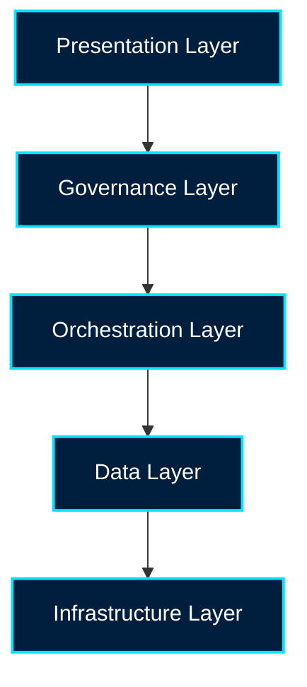

# OmniNStack

OmniNStack lets companies replace repetitive work with AI-powered teams — deploying autonomous AI agents that run real workflows end-to-end, entirely on infrastructure the organization owns.

Built for high-trust enterprises where data can't leave the building, OmniNStack is on-premise and sovereign by design.

## 🌟 Vision

In a world where data sovereignty is non-negotiable, OmniNStack serves as the central nervous system for intelligent operations. We empower enterprises to deploy an AI workforce, automate workflows, and scale operations — breaking free from vendor lock-in while keeping their intelligence within the boundaries of absolute ownership.

## 🧩 The Platform

OmniNStack puts AI-powered teams to work through four tightly integrated capabilities:

- **Multi-Agent Orchestration** — Compose teams of autonomous agents that plan, delegate, and coordinate to complete end-to-end work.
- **Enterprise Knowledge Retrieval** — A sovereign knowledge base delivering high-fidelity, citation-backed answers, without data ever leaving your network.
- **Workflow Automation** — Automate repetitive, multi-step operations, routing each task to the right public or private LLM with zero vendor lock-in.
- **Analytics & Audit** — A live dashboard for every AI-powered team, backed by immutable, identity-aware audit trails on every action.

## 🔬 Proprietary Innovation

OmniNStack is a product company. Our defensibility comes from technology we engineer ourselves to solve problems off-the-shelf AI cannot:

- **Agent Coordination Engine** — A multi-agent orchestration framework where agents plan, delegate, and self-correct reliably across long-running workflows.
- **Sovereign Memory & Retrieval** — Original AI memory architecture and sovereign retrieval that deliver citation-backed knowledge fully on-premise.
- **Edge Inference Optimization** — Inference tuned for NVIDIA TensorRT and Apple MLX, bringing server-grade model performance to edge and sovereign hardware.

## 🏗️ Architecture

OmniNStack operates on a modular, five-layer sovereign stack that ensures scalability, security, and flexibility:



- **Presentation Layer** — Unified command center for human-AI collaboration (Open WebUI, Outward chat interfaces, native IDE plugins).
- **Governance Layer** — Policy-as-Code (OPA) and immutable, identity-aware auditing for every request.
- **Orchestration Layer** — The cognitive engine managing agentic reasoning, omnichannel routing, and industrial AIoT bridging.
- **Data Layer** — Sovereign RAG with secure vector stores and zero data leakage.
- **Infrastructure Layer** — Self-hosted, hardware-agnostic foundation optimized for edge and sovereign nodes.

See the [Technical Whitepaper](https://www.omninstack.com/whitepaper.html) for the full architecture.

## 💻 Repository

This repository hosts the OmniNStack marketing site, served via GitHub Pages at [www.omninstack.com](https://www.omninstack.com). The site is being migrated from a purely hand-authored static HTML structure to a more maintainable template-driven static site.

### Current structure

```text
src/
  _data/          # shared content and product metadata
  _includes/      # layouts and partials
  pages/          # page templates (homepage, product pages, content pages)
styles/           # tokenized CSS system
assets/           # images and icons
script.js         # reveal and responsive navigation behavior
nav-footer.js     # shared chrome injection for legacy pages
package.json      # Eleventy build scripts
.dist/            # generated output (not committed)
```

### Local preview

```bash
npm install
npm run dev
```

Then open the local Eleventy preview URL in the terminal.

### Build output

```bash
npm run build
```

This generates the site into `dist/`, which is the output used for the static publishing pipeline.

### Migration status

The site is progressively moving to:

- componentized page layouts
- data-driven product content
- tokenized styling
- reduced duplication across pages and locales

This reduces maintenance overhead while keeping the current GitHub Pages deployment model intact.

## 🌐 Contact

Ready to deploy your AI workforce? Contact us to schedule a demo or learn more about our enterprise platform.

**Email:** [info@omninstack.com](mailto:info@omninstack.com)

## 🔗 Links

- [Website](https://www.omninstack.com)
- [Technical Whitepaper](https://www.omninstack.com/whitepaper.html)
- [Outward Platform](https://www.omninstack.com/marketing/outward.html)
- [Contexa Platform](https://www.omninstack.com/marketing/contexa.html)
- [LinkedIn](https://www.linkedin.com/in/omninstack/)

---

**OMNINSTACK AI SOLUTIONS INC.** — Proudly designed & engineered in British Columbia, Canada.

*The AI Operations Platform. Deploy your AI workforce.*
